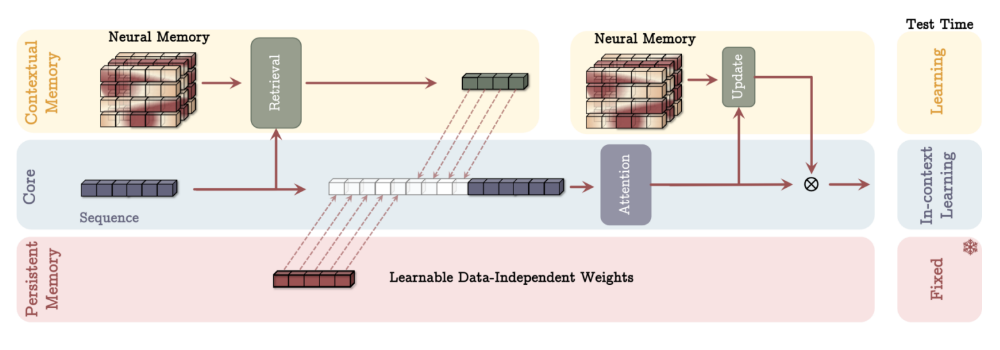
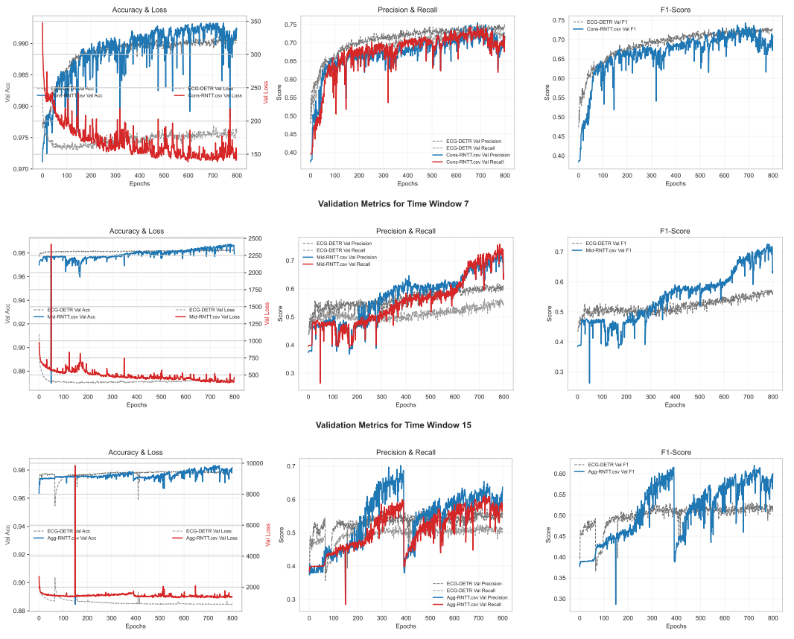

# RhythmNet-TT: Adaptive Arrhythmia Detection Beyond Training

This repository contains the code for **RhythmNet-TT**, a Transformer-based deep learning model for ECG arrhythmia detection.

## Description

RhythmNet-TT is a model that builds upon the **ECG-DETR** architecture. By incorporating a memory module inspired by the **Memory as Context (MAC)** framework, this adaptation aims to improve the model's ability to handle variability in ECG signals and process longer ECG sequences.


*Figure 1: The RhythmNet-TT architecture featuring the Neural Memory module which updates at test-time to adapt to specific patient data distributions.*

## Key Features

* **Adaptive Learning:** Uses a "Neural Memory" to adapt to shifting data distributions during inference (test-time).
* **Long-Sequence Handling:** Optimized for longer contexts (7s and 15s windows) where traditional Transformers often degrade.
* **Hybrid Design:** Combines a CNN backbone with a Transformer encoder and a persistent memory module.

## Performance

We compare RhythmNet-TT against the ECG-DETR baseline on the MIT-BIH Arrhythmia and PhysioNet 2017 datasets. As shown below, our model demonstrates superior stability and learning capability, particularly in **F1 Score** and **Recall** across training epochs.


*Figure 2: Validation metrics comparing ECG-DETR vs. RhythmNet-TT (Mid configuration) on 7-second windows. RhythmNet-TT shows sustained improvement in identifying arrhythmias (F1/Recall) compared to the baseline.*

## Code Structure

The repository is organized as follows:

* `source/`: Contains all code of models (`model_architectures.py`, `titan.py`), experiment training (`arg_extractor.py`, `experiment_builder.py`, `storage_utils.py`), utilities (`loss_functions.py`, `VisualiseResults.ipynb`), along with debugging files.
* `Kaggle_setup/`: Instructions and necessary files to obtain MIT-BIH Atrial Fibrillation dataset in our format (3 s, 7 s, 15 s).
* `./`: Pre-processing code for MIT-BIH Arrhythmia dataset (`Pre-preprocessing_MIT-BIH_Arrhythmia.py`), which requires csv files processed from `get_csv_MIT-BIH_Arrhithmia.ipynb`

## Dependencies

The code requires the following packages (python=3.12.5):
[numpy, scipy, matplotlib, jupyter, pytorch, torchvision, torchaudio]

```bash
pip install -r requirements.txt